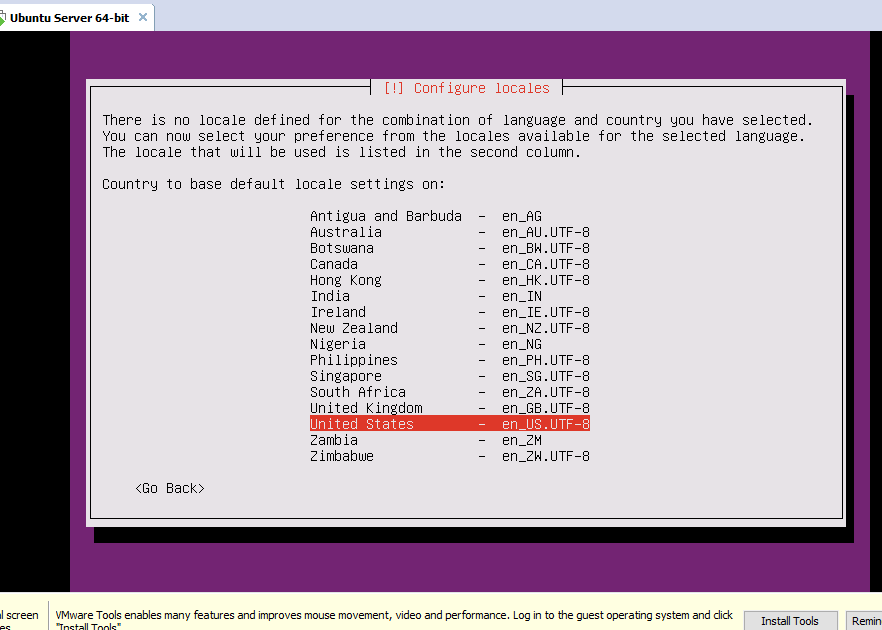
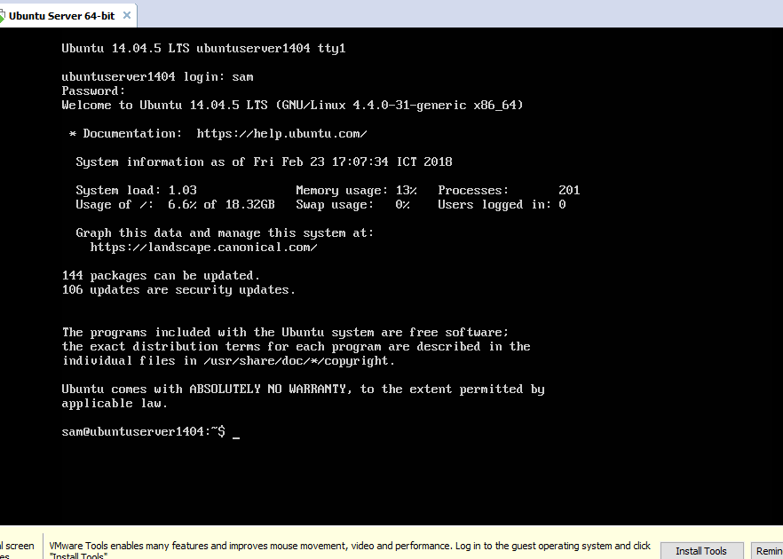

# Cách cài đặt Ubuntu Server 14.04 trên Vmware Workstation 12 Pro

## Yêu cầu:

- Máy tính đã cài đặt VMware Workstation 12 Pro.

- Tải file cài đặt Ubuntu Server, Download file ISO tại [link](http://releases.ubuntu.com/trusty/). Nên dùng bản LTS để có sự ổn định.

## Các bước cài đặt:

- Bước 1: Tạo một máy ảo VMware mới. Chi tiết các bước theo từng ảnh.

    

    

    

    

    

    

    Sau khi ấn Finish bạn đã tạo thành công một máy ảo để cài đặt Ubuntu Server. Nó sẽ tự động Start và đưa chúng ta đến phần cài đặt.

- Bước 2: Cài đặt Ubuntu Server 14.04 và các thiết lập. (Chú ý: để di chuyển giữa các phần khác nhau khi cài đặt, dùng phím TAB. Còn để tick/lựa chọn một option, dùng phím ENTER.)

    1.Chọn ngôn ngữ English, ấn Enter.

    

    2.Tiếp theo chọn Install Ubuntu Server và nhấn Enter .

    

    3.Tiếp theo chọn ngôn ngữ mặc định của hệ thống và cài đặt Ngôn ngữ .

    

    4.Nếu quốc gia của bạn không có trong danh sách  chọn Other và chọn Country của bạn .

    

    5.Chọn lục địa

    

    6.Chọn quốc gia

    

    7.Chọn ngôn ngữ của bạn,  chọn một ngôn ngữ chung như mã hóa UTF-8 để sau đó  không gặp vấn đề với bàn phím.

    

    8.Tiếp tục nhắc cấu hình lại Bàn phím

    

    9.Chọn ngôn ngữ bằn phím

    

    10.Chọn giao diện bàn phím

    

    11.Tải các thành phần bổ sung

    

    12.Thiết lập tên máy chủ hệ thống 

    

    13.Thiết lập người dùng quản trị. Nhập tên đăng nhập và nhấn vào Tiếp tục .

    

    

    14.Thiết lập mật khẩu.

    

    15.Nhập lại mật khẩu.

    

    16.Nếu máy chủ của bạn có chứa dữ liệu nhạy cảm, bí mật hoặc quan trọng trên Users nhà phân vùng, màn hình kế tiếp cung cấp tùy chọn để đảm bảo tất cả các dữ liệu bằng cách mã hóa thư mục. Nếu không cần thiết phải mã hóa dữ liệu chọn No và nhấn Enter .

    

    17.Nếu trong khi trình cài đặt chạy và thẻ giao diện mạng của bạn có kết nối Internet, trình cài đặt sẽ tự động phát hiện Vị trí của bạn và thiết lập đúng múi giờ của bạn . Nếu thời gian cung cấp không được thiết lập đúng, bạn có thể chọn nó bằng tay từ danh sách khác, chọn No và nhấn Enter .

    

    18.Tiếp theo là phân vùng để cài đặt. Chọn Guided-use entire disk andset up LVM và ấn Enter.

    

    19.Chọn phân vùng đĩa,

    

    20.Viết thay đổi cho đĩa.

    

    21.Chọn Continue

    

    22.Sau khi bảng phân vùng đã được ghi lên đĩa cài đặt. Chấp nhận sự thay đổi bảng phân vùng và nhấn Yes .

    

    23.Cài đặt hệ thống.

    

    24.Nếu không truy cập Internet qua proxy thì hãy để trống và Tiếp tục .

    

    25.Cấu hình Apt.

    

    26.Chọn Không cập nhật tự động vì trên máy chủ bạn nên thử cập nhật bằng tay hệ thống hoặc có thể chọn Install security updates automatically để tự động cài đặt các Update liên quan đến bảo mật.

    

    27.Cài đặt OpenSSH để có thể SSH vào server bằng cách nhấn phím Space bar và chọn Continue .

    

    

    

    28.Các gói đã chọn đang được cài đặt trong khi tùy chọn cuối cùng được hiển thị trên màn hình của bạn yêu cầu Cài đặt GRUB sang MRB . Bởi vì hệ thống không thể khởi động trên mình mà không có GRUB , chọn Yes .

    

    29.Nhấn Continue để khởi động.

    

    30.Đã hoàn thành xong quá trình cài đặt. Login bằng User name và Password đã tạo nhé.

    

### Bài viết tham khảo tại [Hướng dẫn cài Ubuntu Server trên VMware Player](https://medium.com/pymi/h%C6%B0%E1%BB%9Bng-d%E1%BA%ABn-c%C3%A0i-ubuntu-server-tr%C3%AAn-vmware-player-726f1f08ad35) và [Cách cài đặt Ubuntu Server 14.04 nhanh nhất](http://vdo.vn/thong-tin-huu-ich/cai-dat-ubuntu-server-14-04.html).
    

    
